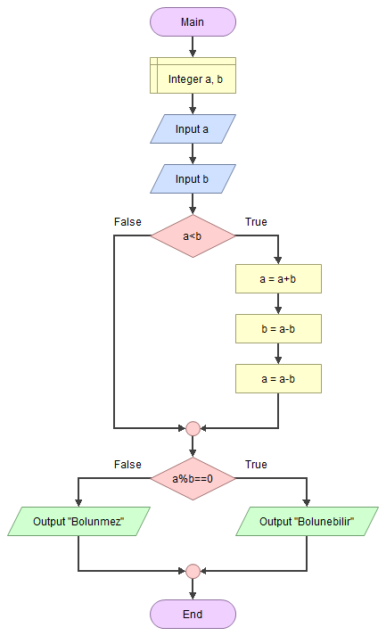

# ➗ İki Sayının Tam Bölünüp Bölünmemesini Tespit Etmek

<!-- ----------------------------- Soru ----------------------------------- -->

## ❓ Soru
Verilen iki sayının birbirine tam olarak bölünüp bölünemeyeceğini bulan algoritmayı yazınız. (Büyük sayı küçük sayıya bölünecek, sayıların girişteki sıraları farklı olabilir.)

<!-- ----------------------------- Program Kısımları ----------------------------------- -->

## ⛓ Program Kısımları
1. `a` ve `b` değerlerini girmek.
2. `a` ile `b`yi karşılaştırmak (Gerekirse değiştirmek).
3. Birbirine bölünüp bölünmediğini öğrenmek.
4. 3.adıma göre sonuç yazdırmak.

<!-- ----------------------------- Çözüm Yöntemi ----------------------------------- -->

## 👓 Çözüm Yöntemi 
- a mod b = 0 ise, `a` ve `b` tam bölündüğü bellidir.

<!-- ----------------------------- Çözüm Adımları ----------------------------------- -->

## 👩‍🔧 Çözüm Adımları
1. `a`, `b`, `c` tanımlanması.
2. `a` ve `b`nin değerlerinin girilmesi.
3. Büyük sayının tespit edilmesi.

   i. `a`nın değerinin `c`de saklanması.

   ii. `b`nin değeri `a`ya atanması.

   iii. `c`de Saklanan değerinin `b`ye aktarılması.

4. Modun kontrol edilmesi:
   
   i. 0 ise `Tam Bolunebilir` yazdırılması.
   
   ii. 0 değilse `Tam Bolunemez` yazdırılması.

<!-- ----------------------------- Kodlar ----------------------------------- -->

## 🤖 Kod

[//]: ------------------------------------------------------------------------------
<!-- ----------------------------- C++ Kodu ----------------------------------- -->
[//]: ------------------------------------------------------------------------------

### ⚙ C++ Kodu

```cpp
#include <iostream>
#include <string>

using namespace std;
int main()
{
    int a, b, c; // “a”, “b”, “c” tanımlanması
    // “a” ve “b”nin değerlerinin girilmesi
    cout<< "a= ";
    cin >> a;
    cout << "b= ";
    cin >> b;
    if (a < b) 
    {
        c = a; // “a”nın değerinin “c”de saklanması  
        a = b; // “b”nin değeri “a”ya atanması
        b = c; // “c”de Saklanan değerinin “b”ye aktarılması
    }
    if (a % b == 0) 
        cout<<"Tam Bolunebilir"; // 0 ise “Tam Bolunebilir” yazdırılması
    else 
        cout<<"Tam Bolunemez"; // 0 değilse “Tam Bolunemez” yazdırılması
    return 0;
}
```

[//]: ------------------------------------------------------------------------------
<!-- ------------------------------ Python Kodu -------------------------------- -->
[//]: ------------------------------------------------------------------------------

### 🐍 Python Kodu
	
```py
#!/usr/bin/python3
# -*- coding: utf-8 -*-

# “a”, “b”, “c” tanımlanması (python dilinde c'nin önceden tanımlanmasına gerek yoktur)
a = input("a=")
b = input("b=")

# Büyük sayının a'ya alınması
if a < b:
    c = a  # “a”nın değerinin “c”de saklanması (python dilinde c'nin önceden tanımlanmasına gerek yoktur)
    a = b  # “b”nin değeri “a”ya atanması
    b = c  # “c”de Saklanan değerinin “b”ye aktarılması
if (a % b) == 0:
    print("Tam bölünebilir")
else:
    print("Tam bölünemez")
```

[//]: ------------------------------------------------------------------------------
<!-- ----------------------------- Java Kodu ----------------------------------- -->
[//]: ------------------------------------------------------------------------------

### ☕ Java Kodu

```java
import java.util.*;
public class onikinci_Program {
 public static void main(String arg[]) {
  Scanner input = new Scanner(System.in);
  int a, b, c; // “a”, “b”, “c” tanımlanması
  // “a” ve “b”nin değerlerinin girilmesi
  System.out.print("a=");
  a = input.nextInt(); 
  System.out.print("b=");
  b = input.nextInt(); 
  // Büyük sayının a'ya alınması
  if (a < b) 
  {
   c = a; // “a”nın değerinin “c”de saklanması
   a = b; // “b”nin değeri “a”ya atanması
   b = c; // “c”de Saklanan değerinin “b”ye aktarılması
  }
  if (a % b == 0) // 0 ise “Tam Bolunebilir” yazdırılması
   System.out.println("Tam Bolunebilir");
  else // 0 değilse “Tam Bolunemez” yazdırılması
   System.out.println("Tam Bolunemez");
 }
}
```
</details>

[//]: ------------------------------------------------------------------------------
<!-- ----------------------------- C# Kodu ----------------------------------- -->
[//]: ------------------------------------------------------------------------------

### ⏹ C# Kodu

```cs
using System;
using System.Collections.Generic;
using System.Linq;
using System.Text;
using System.Threading.Tasks;
namespace IkiSayininBolunmesi{
    class Program{
        static void Main(string[] args){
            int a, b, c;
            Console.Write("a=");
            a = Convert.ToInt32(Console.ReadLine());
            Console.Write("b=");
            b = Convert.ToInt32(Console.ReadLine());
            if (a < b){
                c = a;
                a = b;
                b = c;
            }
            if (a % b == 0)
                Console.WriteLine("bolunebilir");
		        else Console.WriteLine("bolunmez");
                Console.ReadLine();
        }
    }
}
```

<!-- ----------------------------- Akış Şeması ----------------------------------- -->

## 🧩 Akış Şeması



<!-- ----------------------------- Ekran Çıktısı ----------------------------------- -->

## 🎉 Ekran Çıktısı

```
a=5    b=3    Tam Bolunemez
a=2    b=6    Tam Bolunebilir
```

<!-- ----------------------------- Notlar ----------------------------------- -->

## 💡 Notlar 
1. `a`nın değerinin kaybolmaması için geçici değişkende `c` değiştirme işleminin sırasında saklandı.
