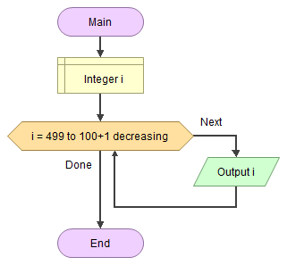

# 🔢 Sayıları Yan Yana Yazdırmak

<!-- ----------------------------- Soru ----------------------------------- -->

## ❓ Soru
500’den 100’e kadar olan sayıları ekrana yan yana yazan algoritmayı yazınız.

<!-- ----------------------------- Program Kısımları ----------------------------------- -->

## ⛓ Program Kısımları
1. 500’den 100’e kadar olan sayıları ekrana yazdırmak.

<!-- ----------------------------- Çözüm Yöntemi ----------------------------------- -->

## 👓 Çözüm Yöntemi 
- Yazdırılacak sayıları bulmak için değeri 500’dan başlayan 100’a kadar azalan bir sayaç oluşturuyoruz, sayacın her azaldığında onun değerini ekrana yazdırıyoruz.

<!-- ----------------------------- Çözüm Adımları ----------------------------------- -->

## 👩‍🔧 Çözüm Adımları
1. `i`nin tanımlanması.
2. Sayacın değerini azaltan bir döngünün oluşturulması.
   * Sayacın değerinin yazdırılması.

<!-- ----------------------------- Kodlar ----------------------------------- -->

## 🤖 Kod

[//]: ------------------------------------------------------------------------------
<!-- ----------------------------- C++ Kodu ----------------------------------- -->
[//]: ------------------------------------------------------------------------------

### ⚙ C++ Kodu

```c++
#include <iostream>
using namespace std;
int main()
{
    int i; // “i”nin tanımlanması
    // Sayacın değerini azaltan bir döngünün oluşturulması
    for (i = 500; i >= 100; i--) 
        cout << i << " - "; // Sayacın değerinin yazdırılması
    return 0;
}
```

[//]: ------------------------------------------------------------------------------
<!-- ----------------------------- Python Kodu ----------------------------------- -->
[//]: ------------------------------------------------------------------------------

### 🐍 Python Kodu

```py
#  Sayacın değerini azaltan bir döngünün oluşturulması
for i in range(500, 99, -1):
    # Sayacın değerinin yazdırılması
    print(i)
```

[//]: ------------------------------------------------------------------------------
<!-- ----------------------------- Java Kodu ----------------------------------- -->
[//]: ------------------------------------------------------------------------------

### ☕ Java Kodu

```java
public class SayilariYazdirmak {
 public static void main(String arg[]) {
  int i; // “i”nin tanımlanması
  for (i = 500; i >= 100; i--) // Sayacın değerini azaltan bir döngünün oluşturulması
   System.out.print(i + " - "); // Sayacın değerinin yazdırılması
 }
}
```

[//]: ------------------------------------------------------------------------------
<!-- ----------------------------- C# Kodu ----------------------------------- -->
[//]: ------------------------------------------------------------------------------

### ⏹ C# Kodu

```cs
using System;
using System.Collections.Generic;
using System.Linq;
using System.Text;
using System.Threading.Tasks;
namespace SayilariYazdirmak{
    class Program{
        static void Main(string[] args){
            int i; // “i”nin tanımlanması
            for (i = 500; i >= 100; i--) // Sayacın değerini azaltan bir döngünün oluşturulması
                Console.Write(i + " - "); // Sayacın değerinin yazdırılması
            Console.ReadLine();
        }
    }
}

```


<!-- ----------------------------- Akış Şeması ----------------------------------- -->

## 🧩 Akış Şeması



<!-- ----------------------------- Ekran Çıktısı ----------------------------------- -->

## 🎉 Ekran Çıktısı

```
500 - 499 – 498 - …………… 
…………… - 102 - 101 - 100 -
```

<!-- ----------------------------- Notlar ----------------------------------- -->

## 💡 Notlar 
1. Değerleri ayırmak için (" - ") yazdırdık.
