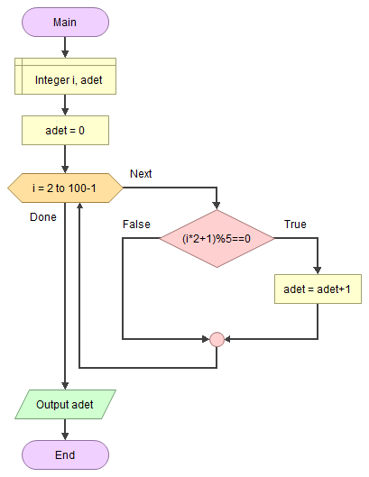

# 🚦 Verilen Koşula Göre Sayıların Sayısını Bulmak

<!-- ----------------------------- Soru ----------------------------------- -->

## ❓ Soru
1 ile 100 arasındaki tamsayılardan 2 katının 1 fazlası, 5 ile tam bölünen kaç sayı olduğunu
bulan algoritmayı yazınız.

<!-- ----------------------------- Program Kısımları ----------------------------------- -->

## ⛓ Program Kısımları
1. Verilen koşulu sağlayan sayıların sayısını bulmak.
2. Sonucu ekrana yazdırmak.

<!-- ----------------------------- Çözüm Yöntemi ----------------------------------- -->

## 👓 Çözüm Yöntemi 
- Bir döngü kullanarak 1,100 arasındaki tüm sayıların koşulu sağlayıp sağlamadığını kontrol ederiz.
- Koşul her sağlandığında `adet` sayacı artacak.

<!-- ----------------------------- Çözüm Adımları ----------------------------------- -->

## 👩‍🔧 Çözüm Adımları
1. `i` ve `adet`in tanımlanması.
2. 2’den 99’a kadar döngünün oluşturulması.
   * Koşulun kontrol edilmesi.
3. `adet`in ekrana yazdırılması.

<!-- ----------------------------- Kodlar ----------------------------------- -->

## 🤖 Kod

[//]: ------------------------------------------------------------------------------
<!-- ----------------------------- C++ Kodu ----------------------------------- -->
[//]: ------------------------------------------------------------------------------

### ⚙ C++ Kodu

```cpp
#include <iostream>
using namespace std;
int main() {
	int i, sayac =  0 ;	// "i" ve "adet"in tanımlanması
	for (i = 2; i < 100; ++i) { // 2’den 99’a kadar döngünün oluşturulması
		if ((i * 2 + 1) % 5 == 0) // Koşulun kontrol edilmesi
			++sayac;
	}
	cout << "Adet : " << sayac << '\n'; // “adet”in ekrana yazdırılması
	return 0;
}

```

[//]: ------------------------------------------------------------------------------
<!-- ----------------------------- Java Kodu ----------------------------------- -->
[//]: ------------------------------------------------------------------------------

### ☕ Java Kodu

```java
public class KosulaGoreSayiBulmak {
 public static void main(String arg[]) {
  int i, adet = 0; // "i" ve "adet"in tanımlanması
  for (i = 2; i < 100; i++) // 2’den 99’a kadar döngünün oluşturulması
   if ((i * 2 + 1) % 5 == 0) // Koşulun kontrol edilmesi
    adet++;
  System.out.println("Adet= " + adet); // “adet”in ekrana yazdırılması
 }
}
```

[//]: ------------------------------------------------------------------------------
<!-- ----------------------------- Python Kodu ----------------------------------- -->
[//]: ------------------------------------------------------------------------------

### 🐍 Python Kodu

```py
# “adet”in tanımlanması
adet = 0
# 2’den 99’a kadar döngünün oluşturulması
for i in range(2,100):
    # Koşulun kontrol edilmesi
    if((i * 2 + 1) % 5 == 0):
        adet += 1
    # “adet”in ekrana yazdırılması
    print("Adet= " , adet)
```

[//]: ------------------------------------------------------------------------------
<!-- ----------------------------- Python Kodu ----------------------------------- -->
[//]: ------------------------------------------------------------------------------

### ⏹ C# Kodu

```cs
using System;
using System.Collections.Generic;
using System.Linq;
using System.Text;
using System.Threading.Tasks;
namespace KosulaGoreSayiBulmak{
    class Program{
        static void Main(string[] args){
            int i, adet = 0; // "i" ve "adet"in tanımlanması
            for (i = 2; i < 100; i++) // 2’den 99’a kadar döngünün oluşturulması
                if ((i * 2 + 1) % 5 == 0) // Koşulun kontrol edilmesi
                    adet++;
            Console.WriteLine("Adet= " + adet); // “adet”in ekrana yazdırılması
            Console.ReadLine();
        }
    }
}
```

<!-- ----------------------------- Akış Şeması ----------------------------------- -->

## 🧩 Akış Şeması



<!-- ----------------------------- Ekran Çıktısı ----------------------------------- -->

## 🎉 Ekran Çıktısı

```
Adet= 20
```

<!-- ----------------------------- Notlar ----------------------------------- -->

## 💡 Notlar 
1. Soruda 1 ile 100 dahil olduğu belirtilmediği için sayılar dahil edilmedi. 
