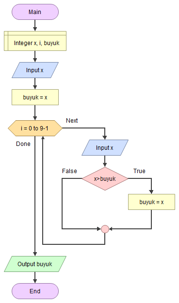

# 🔎 En Büyük Sayıyı Bulmak 

<!-- ----------------------------- Soru ----------------------------------- -->

## ❓ Soru
Girilen 10 tamsayıdan en büyüğünü bulan algoritmayı yazınız.

<!-- ----------------------------- Program Kısımları ----------------------------------- -->

## ⛓ Program Kısımları
1. 10 tane sayı girmek.
2. Girilenlerin en büyüğünü bulmak.
3. En büyüğünü ekrana yazdırmak.

<!-- ----------------------------- Çözüm Yöntemi  ----------------------------------- -->
   
## 👓 Çözüm Yöntemi 
- 10 kere dönen döngüyle sayıları okutabiliriz. Bunun için tek bir değişken `sayi` kullanmamız yeterli.
- En büyük sayıyı tespit etmek için, ilk girilenin en büyük sayı olduğunu farz ederiz.
`(“buyuk” = ilk girilen sayı)`
- Sonraki girilenler `buyuk`ten büyükse değerini değiştiririz.

<!-- ----------------------------- Çözüm Adımları  ----------------------------------- -->

## 👩‍🔧 Çözüm Adımları
1. `sayi`, `buyuk`, `i`nin tanımlanması.
2. İlk sayının döngüye girmeden kullanıcıdan girilmesi en büyük olarak kabul edilmesi.
3. Girilen sayının `buyuk`e atanması.
4. `10-1` kere dönen döngünün oluşturulması.
   1. Sayıların girilmesi.
   2. Sayının `buyuk`le karşılaştırılması.
5. `buyuk`ün ekrana yazdırılması. 

<!-- ----------------------------- Kodlar  ----------------------------------- -->

## 🤖 Kod

[//]: ------------------------------------------------------------------------------
<!-- ----------------------------- C++ Kodu ----------------------------------- -->
[//]: ------------------------------------------------------------------------------

### ⚙ C++ Kodu

```cpp
#include <iostream>
using namespace std;
int main() {
  int enBuyuk, i, sayi; // `sayi`, `buyuk`, `i`nin tanımlanması.
	cout << "10 tane sayi giriniz : ";
	cin >> enBuyuk;			// İlk sayının döngüye girmeden kullanıcıdan girilmesi ve en büyük olarak kabul edilmesi
	for (i = 0; i < 9; ++i) {	// “10-1” kere dönen döngünün oluşturulması
		cin >> sayi; // Sayıların girilmesi
		if (sayi > enBuyuk)
			enBuyuk = sayi;	// Sayının “buyuk”le karşılaştırılması
	}
	cout << "En Buyuk Sayi= " << enBuyuk << '\n'; // “buyuk”ün ekrana yazdırılması.
}
```

[//]: ------------------------------------------------------------------------------
<!-- ----------------------------- Python Kodu ----------------------------------- -->
[//]: ------------------------------------------------------------------------------

### 🐍 Python Kodu

```py
# İlk sayının döngüye girmeden kullanıcıdan girilmesi en büyük olarak kabul edilmesi
sayi = int(input("10 Sayi giriniz: "))
buyuk = sayi # Girilen sayının “buyuk”e atanması
for i in range(0,9): # “10-1” kere dönen döngünün oluşturulması
    sayi = int(input()) # Sayıların girilmesi
    if(sayi > buyuk): # Sayının “buyuk”le karşılaştırılması
        buyuk = sayi
print("En Buyuk sayi= ", buyuk) # “buyuk”ün ekrana yazdırılması
```

[//]: ------------------------------------------------------------------------------
<!-- ----------------------------- Java Kodu ----------------------------------- -->
[//]: ------------------------------------------------------------------------------

### ☕ Java Kodu

```java
import java.util.*;
public class BuyukSayiyiBulmak {
 public static void main(String arg[]) {
  Scanner input = new Scanner(System.in);
  int sayi, i, buyuk; // `sayi`, `buyuk`, `i`nin tanımlanması.
  System.out.println("10 Sayi giriniz:");
  sayi = input.nextInt(); // İlk sayının döngüye girmeden kullanıcıdan girilmesi
  buyuk = sayi; // İlk girilen en büyük olarak kabul edilir 
  for (i = 0; i < 9; i++) // “10-1” kere dönen döngünün oluşturulması
   sayi = input.nextInt(); // Sayıların girilmesi
   if (sayi > buyuk) // Sayının “buyuk”le karşılaştırılması
    buyuk = sayi;
  }
  System.out.println("En Buyuk sayi= " + buyuk); // “buyuk”ün ekrana yazdırılması
  input.close();
 }
}
```

[//]: ------------------------------------------------------------------------------
<!-- ----------------------------- C# Kodu ----------------------------------- -->
[//]: ------------------------------------------------------------------------------

### ⏹ C# Kodu

```cs
using System;
using System.Collections.Generic;
using System.Linq;
using System.Text;
using System.Threading.Tasks;
namespace BuyukSayiyiBulmak{
    class Program{
        static void Main(string[] args){ 
            int sayi, i, buyuk; // `sayi`, `buyuk`, `i`nin tanımlanması.
            Console.WriteLine("10 Sayi giriniz:"); 
            sayi = Convert.ToInt32(Console.ReadLine()); // İlk sayının döngüye girmeden kullanıcıdan girilmesi
            buyuk = sayi; // İlk girilen en büyük olarak kabul edilir 
            for (i = 0; i < 9; i++){ // “10-1” kere dönen döngünün oluşturulması
                sayi = Convert.ToInt32(Console.ReadLine()); // Sayıların girilmesi
                if (sayi > buyuk) // Sayının “buyuk”le karşılaştırılması
                    buyuk = sayi;
            }
            Console.WriteLine(buyuk); //“buyuk”ün ekrana yazdırılması
            Console.ReadLine();
        }
    }
}

```

<!-- ----------------------------- Akış Şeması ----------------------------------- -->

## 🧩 Akış Şeması



<!-- ----------------------------- Ekran Çıktısı  ----------------------------------- -->

## 🎉 Ekran Çıktısı

```
10 Sayi giriniz:
1 10 3 7 4 8 2 3 56 3
En Buyuk sayi= 56
```

<!-- ----------------------------- Notlar  ----------------------------------- -->

## 💡 Notlar 
1. `buyuk`e başlangıç değeri atamak için döngüye girmeden önce ilk sayıyı okutup `buyuk`e atarız.