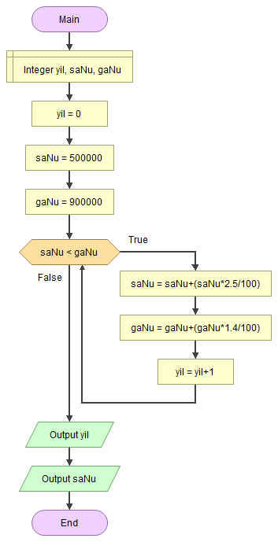

# Nüfus Sayımı İstatistikleri

<!-- ----------------------------- Sorular  ----------------------------------- -->

## ❓ Soru
Şanlıurfa’nın nüfusu 500.000, Gaziantep’in nüfusu 900.000’dir. Doğumlardan ve göçlerden dolayı Şanlıurfa’nın nüfusu yılda %2.5 ve Gaziantep’in nüfusu ise yılda %1.4 oranında artıyor. Buna göre Şanlıurfa’nın nüfusunun kaç yıl sonra Gaziantep’in nüfusunu geçeceğini
bulan ve o andaki nüfuslarını hesaplayan algoritmayı yazınız.

<!-- ----------------------------- Program Kısımları  ----------------------------------- -->

## ⛓ Program Kısımları
1. Şanlıurfa’nın nüfusunun kaç yıl sonra Gaziantep’in nüfusunu geçeceğini ve geçtiği yıldaki nüfusu hesaplamak.
2. Sonuçları ekrana yazdırmak.

<!-- ----------------------------- Çözüm Yöntemi  ----------------------------------- -->
   
## 👓 Çözüm Yöntemi 
- `sa_nu`nun `ga_nu`dan küçük olduğu sürece oranı kullanarak yeni nüfusu hesaplayan ve yılı artıran bir döngü oluştururuz.

<!-- ----------------------------- Çözüm Adımları  ----------------------------------- -->

## 👩‍🔧 Çözüm Adımları
1. Değişkenlerin tanımlanması.
2. `(sa_nu<=ga_nu)` iken:
   1. Nüfusların yeniden hesaplanması.
   2. “yil” sayacının artırılması.
3. Sonuçların ekrana yazdırılması.

<!-- ----------------------------- Kodlar  ----------------------------------- -->

## 🤖 Kod


[//]: ------------------------------------------------------------------------------
<!-- ----------------------------- C++ Kodu ----------------------------------- -->
[//]: ------------------------------------------------------------------------------

### ⚙ C++ Kodu

```cpp
#include <iostream>
using namespace std;
int main()
{
  int yil = 0, sa_nu = 500000, ga_nu = 900000; // Değişkenlerin tanımlanması
  while (sa_nu <= ga_nu) 
  {
    // Nüfusların yeniden hesaplanması
   sa_nu = (int)(sa_nu + (sa_nu * 2.5 / 100));
   ga_nu = (int)(ga_nu + (ga_nu * 1.4 / 100));
   yil++; // “yil” sayacının artırılması
  }
  cout << yil << " yil sonra Sanliurfa nufusu " << sa_nu << " olacak "; // Sonuçların ekrana yazdırılması
}
```

[//]: ------------------------------------------------------------------------------
<!-- ----------------------------- Python Kodu ----------------------------------- -->
[//]: ------------------------------------------------------------------------------

### 🐍 Python Kodu

```py
# Değişkenlerin tanımlanması
yil = 0
sa_nu = 500000
ga_nu = 900000
while (sa_nu <= ga_nu):
    # Nüfusların yeniden hesaplanması
    sa_nu = (int)(sa_nu + (sa_nu * 2.5 / 100))
    ga_nu = (int)(ga_nu + (ga_nu * 1.4 / 100))
    yil += 1 # “yil” sayacının artırılması
print(yil ," yil sonra Sanliurfa nufusu ", sa_nu, " olacak ") # Sonuçların ekrana yazdırılması
```

[//]: ------------------------------------------------------------------------------
<!-- ----------------------------- Java Kodu ----------------------------------- -->
[//]: ------------------------------------------------------------------------------

### ☕ Java Kodu

```java
public class NufusSayimi {
 public static void main(String arg[]) {
  int yil = 0, sa_nu = 500000, ga_nu = 900000; // Değişkenlerin tanımlanması
  while (sa_nu <= ga_nu) 
  {
   // Nüfusların yeniden hesaplanması
   sa_nu = (int)(sa_nu + (sa_nu * 2.5 / 100)); 
   ga_nu = (int)(ga_nu + (ga_nu * 1.4 / 100));
   yil++; // “yil” sayacının artırılması
  }
  System.out.println(yil + " yil sonra Sanliurfa nufusu "+sa_nu+" olacak "); // Sonuçların ekrana yazdırılması
  }
 }
```

[//]: ------------------------------------------------------------------------------
<!-- ----------------------------- C# Kodu ----------------------------------- -->
[//]: ------------------------------------------------------------------------------

### ⏹ C# Kodu

```cs
using System;
using System.Collections.Generic;
using System.Linq;
using System.Text;
using System.Threading.Tasks;
namespace NufusSayimi{
    class Program{
        static void Main(string[] args){
            int yil = 0, sa_nu = 500000, ga_nu = 900000; // Değişkenlerin tanımlanması
            while (sa_nu < ga_nu){
                // Nüfusların yeniden hesaplanması
                sa_nu = (int)(sa_nu + (sa_nu * 2.5 / 100));
                ga_nu = (int)(ga_nu + (ga_nu * 1.4 / 100));
                yil++; // “yil” sayacının artırılması
            }
            // Sonuçların ekrana yazdırılması
            Console.WriteLine(yil);
            Console.WriteLine(sa_nu);
            Console.ReadLine();
        }
    }
}

```

<!-- ----------------------------- Akış Şeması ----------------------------------- -->

## 🧩 Akış Şeması



<!-- ----------------------------- Ekran Çıktısı ----------------------------------- -->

## 🎉 Ekran Çıktısı

```
55 yil sonra Sanliurfa nufusu 1944329 olacak
```

<!-- ----------------------------- Notlar ----------------------------------- -->

## 💡 Notlar 
1. Nüfus sayısını rasyonel sayıyla çarptığımız için sonuç da rasyonel oldu. O yüzden sayıyı `int`e dönüştürmek zorunda kaldık.