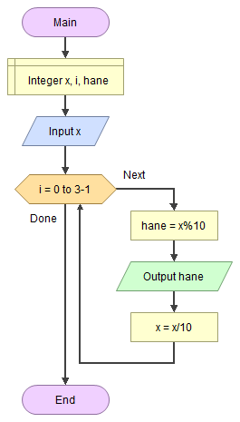

# 🎶 Bir Sayının Rakamlarını Bulmak

<!-- ----------------------------- Soru  ----------------------------------- -->

## ❓ Soru
Üç haneli bir tamsayının birler, onlar ve yüzler hanesini bulan algoritmayı yazınız.

<!-- ----------------------------- Program Kısımları  ----------------------------------- -->

## ⛓ Program Kısımları
1. `x` değerini girmek.
2. Birler, onlar ve yüzler basamaklarını bulmak.
3. Bulunanları ekrana yazdırmak.

<!-- ----------------------------- Çözüm Yöntemi  ----------------------------------- -->
   
## 👓 Çözüm Yöntemi 
- Bir sayının birleri: sayının 10’a bölündüğünden kalandır.
`Örnek: x= 285, x%10= 5`
- Önceki adıma göre; Sayının onlar basamağını bulmak için onlar basamağını birler basamağına dönüştürmek gerek. Bunu yapmak için `x`i 10’a böleriz. Benzer şekilde sayının tüm hanelerini bulabiliriz.
`Örnek: x= 285 ----/10-----> x= 28 ----/10-----> x= 2`

<!-- ----------------------------- Çözüm Adımları  ----------------------------------- -->

## 👩‍🔧 Çözüm Adımları
1. `x` ve `i`nin tanımlanması.
2. `x`in girilmesi.
3. 3 kere dönen döngünün oluşturulması.
   - Kalanın yazdırılması.
   - `x`in onlar basamağının birler basamağına dönüştürülmesi.

<!-- ----------------------------- Kodlar  ----------------------------------- -->

## 🤖 Kod

[//]: ------------------------------------------------------------------------------
<!-- ----------------------------- C++ Kodu ----------------------------------- -->
[//]: ------------------------------------------------------------------------------

### ⚙ C++ Kodu

```cpp
#include <iostream>
using namespace std;
int main() {
	int sayi, i; // “x” ve “i”nin tanımlanması
    cout << "3 haneli bir sayi giriniz : ";
	cin >> sayi; // “x”in girilmesi
	for (i = 0; i < 3; ++i) { // 3 kere dönen döngünün oluşturulması
		cout << sayi % 10 << '\n'; // Kalanın yazdırılması
		sayi = sayi / 10; // “x”in onlar basamağının birler basamağına dönüştürülmesi
	} 
}
```

[//]: ------------------------------------------------------------------------------
<!-- ----------------------------- Python Kodu ----------------------------------- -->
[//]: ------------------------------------------------------------------------------

### 🐍 Python Kodu

```py
print("3 haneli sayi giriniz: ")
# “x”in girilmesi
x = int(input())
# 3 kere dönen döngünün oluşturulması
for i in range(0, 3):
    print(x % 10) #  Kalanın yazdırılması
    x = x / 10 # “x”in onlar basamağının birler basamağına dönüştürülmesi

```

[//]: ------------------------------------------------------------------------------
<!-- ----------------------------- Java Kodu ----------------------------------- -->
[//]: ------------------------------------------------------------------------------

### ☕ Java Kodu

```java
import java.util.*;
public class RakamSayisi {
 public static void main(String arg[]) {
  Scanner input = new Scanner(System.in);
  int x, i; // “x” ve “i”nin tanımlanması
  System.out.println("3 haneli sayi giriniz:");
  x = input.nextInt(); // “x”in girilmesi
  for (i = 0; i < 3; i++) { // 3 kere dönen döngünün oluşturulması
   System.out.println(x % 10); // Kalanın yazdırılması    
   x = x / 10; // “x”in onlar basamağının birler basamağına dönüştürülmesi
  }
  input.close();
 }
}
```

### ⏹ C# Kodu

```cs
using System;
using System.Collections.Generic;
using System.Linq;
using System.Text;
using System.Threading.Tasks;
namespace RakamSayisi{
    class Program{
        static void Main(string[] args){
            int x, i; // “x” ve “i”nin tanımlanması
            x = Convert.ToInt32(Console.ReadLine()); // “x”in girilmesi
            for (i = 0; i < 3; i++){ // 3 kere dönen döngünün oluşturulması
                Console.WriteLine(x % 10); // Kalanın yazdırılması   
                x = x / 10; // “x”in onlar basamağının birler basamağına dönüştürülmesi
            }
            Console.ReadLine();
        }
    }
}

```

<!-- ----------------------------- Akış Şeması ----------------------------------- -->

## 🧩 Akış Şeması



<!-- ----------------------------- Ekran Çıktısı  ----------------------------------- -->

## 🎉 Ekran Çıktısı

```
3 haneli sayi giriniz:
235
5
3
2
```

<!-- ----------------------------- Notlar  ----------------------------------- -->

## 💡 Notlar 
1. `int/int=int` olduğu bellidir.
   - Örnek: 159/10=15 (kalan ihmal edildi).