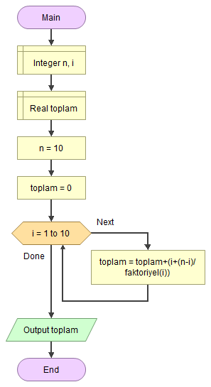
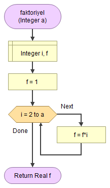

# 🖇 Bir Seri Değerini Hesaplamak

<!-- ----------------------------- Soru ----------------------------------- -->

## ❓ Soru
Aşağıda verilen işlemin sonucunu N=10 değeri için hesaplayan algoritmayı yazınız.


<!-- ----------------------------- Program Kısımları ----------------------------------- -->

## ⛓ Program Kısımları
1. N değerini formüle yerleştirerek sonucu elde etmek.
2. Hesaplanan toplamın sonucunu ekrana yazdırmak.

<!-- ----------------------------- Çözüm Yöntemi ----------------------------------- -->
   
## 👓 Çözüm Yöntemi 
- Formülde görüldüğu gibi, `n` değeri sabit, `i` artıyor.
- `i`nin değişmesini sağlamak için 10 kere dönen bir döngü kullanırız. Döngü her döndüğünde `i`yi artırıp formüle yerleştiririz.

<!-- ----------------------------- Çözüm Adımları ----------------------------------- -->

## 👩‍🔧 Çözüm Adımları
1. `n` ve `i`nin tanımlanması.
2. “toplam”ın float (reel) tanımlanması.
3. 1’den 10’a kadar döngünün oluşturulması.
a- `i`ye göre terim değerinin hesaplanıp önceki toplama eklenmesi.
4. Formül sonucunun ekrana yazdırılması.

<!-- ----------------------------- Kodlar ----------------------------------- -->

## 🤖 Kod

[//]: ------------------------------------------------------------------------------
<!-- ----------------------------- C++ Kodu ----------------------------------- -->
[//]: ------------------------------------------------------------------------------

### ⚙ C++ Kodu

```cpp
#include <iostream>
using namespace std;
float faktoriyel(int a) { 
    int f = 1, i;
    for (i = 2; i <= a; i++)
        f = f * i;
    return f;
}

int main()
{
    int n = 10, i; // “n” ve “i”nin tanımlanması
    float toplam = 0; // “toplam”ın float (reel) tanımlanması
    for (i = 1; i <= 10; i++) { // 1’den 10’a kadar döngünün oluşturulması
        // “i”ye göre terim değerinin hesaplanıp önceki toplama eklenmesi
        toplam = toplam + (i + (n - i) / faktoriyel(i)); 
    }
    cout << toplam; // Formül sonucunun ekrana yazdırılması 
 }
```

[//]: ------------------------------------------------------------------------------
<!-- ----------------------------- Python Kodu ----------------------------------- -->
[//]: ------------------------------------------------------------------------------

### 🐍 Python Kodu

```py
# faktoryel fonksiyonun yazılması
def faktoriyel(a):
    f = 1
    i = 0
    for i in range(2,a+1):
        f = f * i
    return f

# “toplam”,“n” ve “i”nin tanımlanması.
n = 10
toplam = 0
# 1’den 10’a kadar döngünün oluşturulması
for i in range(1,11):
    # “i”ye göre terim değerinin hesaplanıp önceki toplama eklenmesi
    toplam = toplam + (i + (n - i) / faktoriyel(i))
print(toplam) # Formül sonucunun ekrana yazdırılması
```

[//]: ------------------------------------------------------------------------------
<!-- ----------------------------- Java Kodu ----------------------------------- -->
[//]: ------------------------------------------------------------------------------

### ☕ Java Kodu

```java
public class Seri {
 public static void main(String arg[]) {
  int n = 10, i; // “n” ve “i”nin tanımlanması
  float toplam = 0; // “toplam”ın float (reel) tanımlanması
  for (i = 1; i <= 10; i++) // 1’den 10’a kadar döngünün oluşturulması
  {
    // “i”ye göre terim değerinin hesaplanıp önceki toplama eklenmesi
    toplam = toplam + (i + (n - i) / faktoriyel(i)); 
  }
  System.out.println(toplam); // Formül sonucunun ekrana yazdırılması 
 }
 public static float faktoriyel(int a) { 
  int f = 1, i;
  for (i = 2; i <= a; i++)
   f = f * i;
  return f;
 }
}
```

[//]: ------------------------------------------------------------------------------
<!-- ----------------------------- C# Kodu ----------------------------------- -->
[//]: ------------------------------------------------------------------------------

### ⏹ C# Kodu

```cs
using System;
using System.Collections.Generic;
using System.Linq;
using System.Text;
using System.Threading.Tasks;
namespace Seri{
    class Program{
        static void Main(string[] args){
            int n = 10, i; // “n” ve “i”nin tanımlanması
            float toplam = 0; // “toplam”ın float (reel) tanımlanması
            for (i = 1; i <= 10; i++){ // 1’den 10’a kadar döngünün oluşturulması
                // “i”ye göre terim değerinin hesaplanıp önceki toplama eklenmesi
                toplam = toplam + (i + (n - i) / faktoryel(i));
            }
            Console.WriteLine(toplam);  // Formül sonucunun ekrana yazdırılması 
            Console.ReadLine();
        }
        public static float faktoryel(int a){
            int f = 1, i;
            for (i = 2; i <= a; i++)
                f = f * i;
            return f;
        }
 
    }
}

```

<!-- ----------------------------- Akış Şeması ----------------------------------- -->

## 🧩 Akış Şeması

### Main



### Faktoriyel




<!-- ----------------------------- Ekran Çıktısı ----------------------------------- -->

## 🎉 Ekran Çıktısı

```
69.46454
```

<!-- ----------------------------- Notlar ----------------------------------- -->

## 💡 Notlar 
1. Fonksiyon kavramını kullanarak önceki örnekte gördüğümüz faktöriyel hesaplama algoritmasını `faktoriyel(int a)` fonksiyonu içinde yazdık.