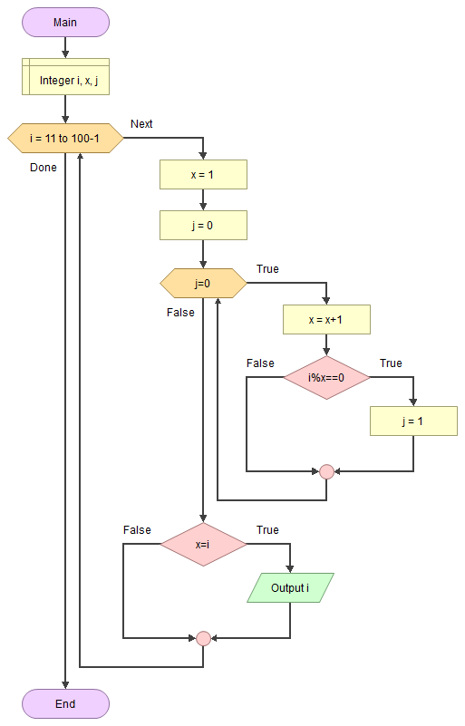

# 😎 Asal Sayılar

<!-- ----------------------------- Soru ----------------------------------- -->

## ❓ Soru
10 ile 200 arasındaki tamsayılardan asal sayı olanları bulan algoritmayı yazınız.

<!-- ----------------------------- Program Kısımları ----------------------------------- -->

## ⛓ Program Kısımları
1. 10 ile 200 arasındaki sayıları kontrol ederek asal olanları bulmak.
2. Asal olanları ekrana yazdırmak.

<!-- ----------------------------- Çözüm Yöntemi ----------------------------------- -->
   
## 👓 Çözüm Yöntemi 
- Asal sayı: Yalnız bir ve kendisi ile bölünebilen birden büyük doğal sayıdır.
- Bir `i` sayısı asal olup olmadığını tespit etmek için `x=2`den `x=i-1`e kadar artan bir sayaç oluştururuz. `x` sayının bir böleni olup olmadığını kontrol ederiz.

<!-- ----------------------------- Çözüm Adımları ----------------------------------- -->

## 👩‍🔧 Çözüm Adımları
1. `i`, `x`, “j”nin tanımlanması.
2. 11’den 99’a kadar döngünün oluşturulması.
   - `x` ile `j`ye başlangıç değerinin atanması
   - `x` ile `i/2+1` eşit olmadığı sürece:
     - `x`in `i`nin bir böleni olup olmadığının kontrol edilmesi.
   - Asal sayıların ekrana yazdırılması.

<!-- ----------------------------- Kodlar ----------------------------------- -->

## 🤖 Kod

[//]: ------------------------------------------------------------------------------
<!-- ----------------------------- C++ Kodu ----------------------------------- -->
[//]: ------------------------------------------------------------------------------

### ⚙ C++ Kodu

```cpp
#include <iostream>
using namespace std;
int main()
{
    int i, x, j; // “i”, “x”, “j”nin tanımlanması
    for (i = 11; i < 100; i++){ // 11’den 99’a kadar döngünün oluşturulması
        // “x” ile “j”ye başlangıç değerinin atanması   
        x = 2;
        j = 0; 
        // “x” ile “i/2+1” eşit olmadığı sürece:
        // “x” değeri hiçbir zaman (i/2+1) değeri ile “i”yi bölemez.
        // Bu yüzden bu değerin (i/2+1) üstünü kontrol etmeye gerek yoktur
        while (x != i / 2 + 1){
            if (i % x == 0) { // “x”in “i”nin bir böleni olup olmadığının kontrol edilmesi   
                j = 1;
                break; // En az bir bölen bulunursa sayının asal olmadığını öğrenmek için yeterlidir 
            } else 
                x++;
    }
    if (j == 0)
        cout << i << " "; // Asal sayıların ekrana yazdırılması 
    }
 }

```

[//]: ------------------------------------------------------------------------------
<!-- ----------------------------- Python Kodu ----------------------------------- -->
[//]: ------------------------------------------------------------------------------

### 🐍 Python Kodu

```py
# 11’den 99’a kadar döngünün oluşturulması.
for i in range(11, 100):
    # “x”e yeni değerinin atanması
    x = 2
    j = 0
    # “x” ile “i” eşit olmadığı sürece:
    # döngü devam edecek
    while (x != i):
        if (i%x == 0): # “x”in “i”nin bir böleni olup olmadığının kontrol edilmesi
            j =1
            break # En az bir bölen bulunursa sayının asal olmadığını öğrenmek için yeterlidir
        else:
            x += 1
    if (j == 0):
        # Asal sayıların ekrana yazdırılması
        print(i)
```

[//]: ------------------------------------------------------------------------------
<!-- ----------------------------- Java Kodu ----------------------------------- -->
[//]: ------------------------------------------------------------------------------

### ☕ Java Kodu

```java
public class Asal {
 public static void main(String arg[]) {
  int i, x, j; // “i”, “x”, “j”nin tanımlanması
  for (i = 11; i < 100; i++) { // 11’den 99’a kadar döngünün oluşturulması
   // “x” ile “j”ye başlangıç değerinin atanması   
   x = 2;
   j = 0; 
   // “x” ile “i/2+1” eşit olmadığı sürece:
   // “x” değeri hiçbir zaman (i/2+1) değeri ile “i”yi bölemez.
   // Bu yüzden bu değerin (i/2+1) üstünü kontrol etmeye gerek yoktur
   while (x != i / 2 + 1){  // “x”in “i”nin bir böleni olup olmadığının kontrol edilmesi
    if (i % x == 0) {
     j = 1;
     break; // En az bir bölen bulunursa sayının asal olmadığını öğrenmek için yeterlidir 
    } else x++;
   }
   if (j == 0)
    System.out.println(i); // Asal sayıların ekrana yazdırılması 
  }
 }
}
```

[//]: ------------------------------------------------------------------------------
<!-- ----------------------------- C# Kodu ----------------------------------- -->
[//]: ------------------------------------------------------------------------------

### ⏹ C# Kodu

```cs
using System;
using System.Collections.Generic;
using System.Linq;
using System.Text;
using System.Threading.Tasks;
namespace Asal{
    class Program{
        static void Main(string[] args){
            int i, x, j; // “i”, “x”, “j”nin tanımlanması
            for (i = 11; i < 100; i++){ // 11’den 99’a kadar döngünün oluşturulması
                // “x” ile “j”ye başlangıç değerinin atanması   
                x = 2; 
                j = 0;
                // “x” ile “i/2+1” eşit olmadığı sürece:
                // “x” değeri hiçbir zaman (i/2+1) değeri ile “i”yi bölemez.
                // Bu yüzden bu değerin (i/2+1) üstünü kontrol etmeye gerek yoktur
                while (x != i){
                    if (i % x == 0){
                        j = 1;
                        break; // En az bir bölen bulunursa sayının asal olmadığını öğrenmek için yeterlidir 
                    }
                    else x++; 
                }
                if (j == 0)
                    Console.WriteLine(i); // Asal sayıların ekrana yazdırılması
            }
            Console.ReadLine();
        }
    }
}

```


<!-- ----------------------------- Akış Şeması ----------------------------------- -->

## 🧩 Akış Şeması



<!-- ----------------------------- Ekran Çıktısı ----------------------------------- -->


## 🎉 Ekran Çıktısı

```
11  13  17  19  23
29  31  37  41  43
47  53  59  61  67
71  73  79  83  89
97
```

<!-- ----------------------------- Notlar ----------------------------------- -->

## 💡 Notlar 
1. En az bir bölen bulunursa sayının asal olmadığını öğrenmek için yeterlidir. O yüzden sonraki değerleri kontrol etmeden döngüden çıkılır.
2. `x` değeri hiçbir zaman `(i/2+1)` değeri ile `i`yi bölemez. Bu yüzden bu değerin `(i/2+1)` üstünü kontrol etmeye gerek yoktur. Örnek: `i= 10` için `10/2+1` değeri hiçbir zaman 10’u tam bölemez. Diğer sayıları da buna kıyas edebiliriz.