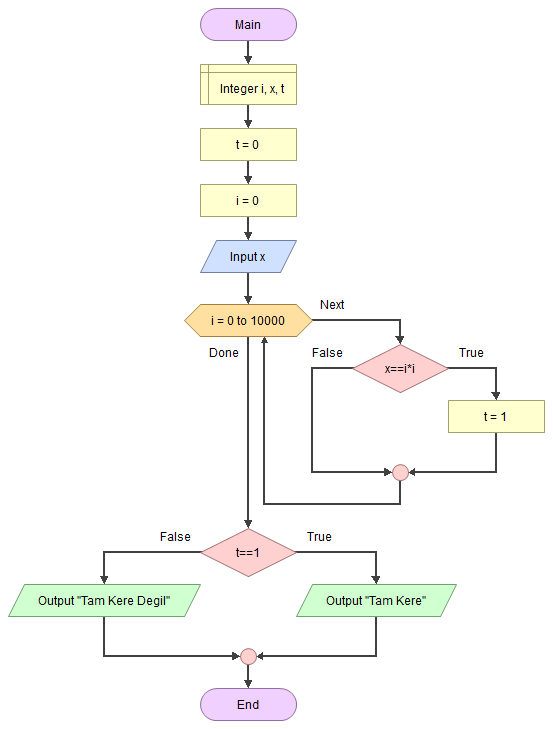

# 🔲 Tam Kare Sayılar

<!-- ----------------------------- Soru ----------------------------------- -->

## ❓ Soru
Girilen bir tamsayının tam kare olup olmadığını bulan algoritmayı yazınız.

<!-- ----------------------------- Program Kısımları ----------------------------------- -->

## ⛓ Program Kısımları
1. Sayı girmek.
2. Tam kare olup olmadığını tespit etmek.
3. Sonucu ekrana yazdırmak.

<!-- ----------------------------- Çözüm Yöntemi ----------------------------------- -->
   
## 👓 Çözüm Yöntemi 
- Bir `x` sayısı tam kare olması için `(x=i*i)` koşulunu sağlayan bir `i` bulunması lazım.
- `i`yi bulmak için 0 ile `(x/2+1)` arasındaki sayıları kontrol ederiz.

<!-- ----------------------------- Çözüm Adımları ----------------------------------- -->

## 👩‍🔧 Çözüm Adımları
1. Değişkenlerin tanımlanması.
2. `x`in girilmesi.
3. `(x/2+1)` kere dönen döngünün oluşturulması.
a- Koşulun kontrol edilmesi.
4. Sonucun yazdırılması.

<!-- ----------------------------- Kodlar ----------------------------------- -->

## 🤖 Kod

[//]: ------------------------------------------------------------------------------
<!-- ----------------------------- C++ Kodu ----------------------------------- -->
[//]: ------------------------------------------------------------------------------

### ⚙ C++ Kodu

```cpp
#include <iostream>
using namespace std;
int main() {
  int i, x, t = 0; // Değişkenlerin tanımlanması
  cin >> x; // “x”in girilmesi
  for (i = 0; i <= x / 2 + 1; i++) { // (X/2+1) kere dönen döngünün oluşturulması
    if (x == i * i)  // Koşulun kontrol edilmesi
    {
      t = 1;
      break; // Fazladan işlem yaptırmamak için karekökü bulunduğunda döngüden çıkarız
    }
  }
  // Koşulun sağlanıp sağlanmadığını kontrol etmek için “t”yi kullandık, çünkü koşul sağlandığında “t” değişecek
  // Sonucun yazdırılması
  if (t != 0)
    cout << "tam kare";
  else
    cout << "tam kare degil";
}
```

[//]: ------------------------------------------------------------------------------
<!-- ----------------------------- Python Kodu ----------------------------------- -->
[//]: ------------------------------------------------------------------------------

### 🐍 Python Kodu

```py
t = 0 # Değişkenlerin tanımlanması
x = int(input()) # “x”in girilmesi
for i in range(0, x // 2 + 2): # (X//2+2) kere dönen döngünün oluşturulması
    if (x == i * i): # Koşulun kontrol edilmesi
        t = 1
        break # Fazladan işlem yaptırmamak için karekökü bulunduğunda döngüden çıkarız
# Koşulun sağlanıp sağlanmadığını kontrol etmek için “t”yi kullandık, çünkü koşul sağlandığında “t” değişecek
# Sonucun yazdırılması
if (t != 0):
    print("tam kare")
else:
    print("tam kare degil")
```

[//]: ------------------------------------------------------------------------------
<!-- ----------------------------- Java Kodu ----------------------------------- -->
[//]: ------------------------------------------------------------------------------

### ☕ Java Kodu

```java
import java.util.*;
public class TamKare {
 public static void main(String arg[]) {
  Scanner input = new Scanner(System.in);
  int i, x, t = 0; // Değişkenlerin tanımlanması
  x = input.nextInt(); // “x”in girilmesi
  for (i = 0; i <= x / 2 + 1; i++) { // (X/2+1) kere dönen döngünün oluşturulması
   // Koşulun kontrol edilmesi
   if (x == i * i) 
   {
    t = 1;
    break; // Fazladan işlem yaptırmamak için karekökü bulunduğunda döngüden çıkarız
   }
  }
  // Koşulun sağlanıp sağlanmadığını kontrol etmek için “t”yi kullandık, çünkü koşul sağlandığında “t” değişecek
  // Sonucun yazdırılması
  if (t != 0)
   System.out.println("tam kare"); 
  else
   System.out.println("tam kare degil");
  input.close();
 }
}
```

[//]: ------------------------------------------------------------------------------
<!-- ----------------------------- C# Kodu ----------------------------------- -->
[//]: ------------------------------------------------------------------------------

### ⏹ C# Kodu

```cs
using System;
using System.Collections.Generic;
using System.Linq;
using System.Text;
using System.Threading.Tasks;
namespace TamKare {
    class Program {
        static void Main(string[] args) {
            int i, x, t = 0; // Değişkenlerin tanımlanması
            x = Convert.ToInt32(Console.ReadLine()); // “x”in girilmesi
            for (i = 0; i <= x / 2 + 1; i++) { // (X/2+1) kere dönen döngünün oluşturulması
                if (x == i * i) {
                    t = 1;
                    break; // Fazladan işlem yaptırmamak için karekökü bulunduğunda döngüden çıkarız
                }
            }
            // Koşulun sağlanıp sağlanmadığını kontrol etmek için “t”yi kullandık, çünkü koşul sağlandığında “t” değişecek
            // Sonucun yazdırılması
            if (t == 1)
                Console.WriteLine("tam kare");
		        else
			        Console.WriteLine("tam kare degil");
            Console.ReadLine();
        }
    }
}
```

<!-- ----------------------------- Akış Şeması ----------------------------------- -->

## 🧩 Akış Şeması



<!-- ----------------------------- Ekran Çıktısı ----------------------------------- -->

## 🎉 Ekran Çıktısı

```
81
tam kare
27
tam kare degil
```

<!-- ----------------------------- Notlar ----------------------------------- -->

## 💡 Notlar 
1. Fazladan işlem yaptırmamak için karekökü bulunduğunda döngüden çıkarız.
2. Koşulun sağlanıp sağlanmadığını kontrol etmek için `t`yi kullandık, çünkü koşul sağlandığında `t` değişecek.