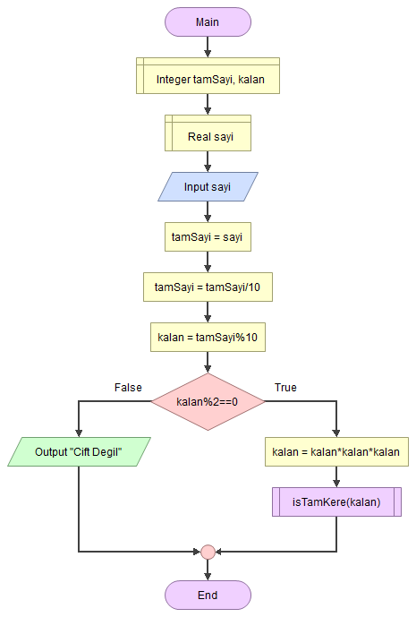
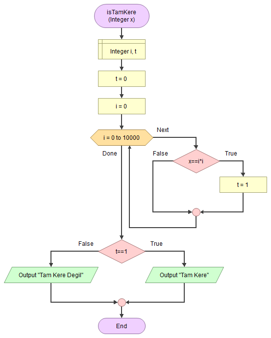

# 🔟0️⃣ Yüzler Basamağı Üzerinde İşlemler Yapmak

<!-- ----------------------------- Soru ----------------------------------- -->

## ❓ Soru
Tam kısmındaki değeri en fazla 4 haneli girilen bir rasyonel sayının tam kısmının yüzler hanesindeki değeri çift ise bu değerin küpünün bir tam kare olup olmadığını bulan algoritmayı yazınız.

<!-- ----------------------------- Program Kısımları ----------------------------------- -->

## ⛓ Program Kısımları
1. Sayı girmek.
2. Koşulun sağlanıp sağlanmadığını kontrol etmek.
3. Sonucu ekrana yazdırmak.

<!-- ----------------------------- Çözüm Yöntemi ----------------------------------- -->
   
## 👓 Çözüm Yöntemi 
- Ondalık kısmını yok etmek için sayı `int`e dönüştürürüz.
- Yüzleri bulduktan sonra koşulu kontrol ederiz.

<!-- ----------------------------- Çözüm Adımları ----------------------------------- -->

## 👩‍🔧 Çözüm Adımları
1. Değişkenlerin tanımlanması.
2. `sayı`nın girilmesi.
3. `sayı`nın `int`’e dönüştürülmesi.
4. Yüzler basamağının bulunması.
5. Koşulun kontrol edilmesi.
6. Sonuçların yazdırılması.

<!-- ----------------------------- Kodlar ----------------------------------- -->

## 🤖 Kod

[//]: ------------------------------------------------------------------------------
<!-- ----------------------------- C++ Kodu ----------------------------------- -->
[//]: ------------------------------------------------------------------------------

### ⚙ C++ Kodu

```cpp
#include <iostream>
using namespace std;

void is_tam_kare(int x) {
  int i, t = 0;
  for (i = 0; i <= x / 2 + 1; i++) {
   if (x == i * i) {
    t = 1;
    break;
   }
  }
  if (t == 1)
   // Sonuçların yazdırılması  
   cout << "tam kare"; 
  else
   cout << "tam kare degil";
}

int main()
{
  int tam_sayi, kalan = 0; // Değişkenlerin tanımlanması 
  float sayi;
  cin >> sayi; // “sayı”nın girilmesi
  tam_sayi = (int) sayi; // “sayı”nın int’e dönüştürülmesi
  tam_sayi = tam_sayi / 100; // Yüzler basamağının bulunması
  kalan = tam_sayi % 10;
  // Koşulun kontrol edilmesi
  if (kalan % 2 == 0) { 
   kalan = kalan * kalan * kalan;
   is_tam_kare(kalan);
  } else
   cout << "cift degil"; // Sonuçların yazdırılması
 }
```

[//]: ------------------------------------------------------------------------------
<!-- ----------------------------- Python Kodu ----------------------------------- -->
[//]: ------------------------------------------------------------------------------

### 🐍 Python Kodu

```py
def is_tam_kare(x):
    t = 0
    for i in range(0,x//2+2):
        if (x == i * i):
            t = 1
            break
    if (t == 1):
        # Sonuçların yazdırılması
        print("tam kare")
    else:
        print("tam kare degil")

# Değişkenlerin tanımlanması
kalan = 0
sayi = float(input())
# “sayı”nın int’e dönüştürülmesi
tam_sayi = int(sayi)
tam_sayi = tam_sayi / 100 # Yüzler basamağının bulunması
# kalan float çıktığı için tekrar tip dönüşümü yapılması
kalan = int(tam_sayi % 10)
# Koşulun kontrol edilmesi
if (kalan % 2 == 0):
    kalan = kalan * kalan * kalan
    is_tam_kare(kalan)
else:
    # Sonuçların yazdırılması
    print("cift degil")
```

[//]: ------------------------------------------------------------------------------
<!-- ----------------------------- Java Kodu ----------------------------------- -->
[//]: ------------------------------------------------------------------------------


### ☕ Java Kodu

```java
import java.util.*;
public class YuzlerIslemleri {
 public static void main(String arg[]) {
  Scanner input = new Scanner(System.in);
  // Değişkenlerin tanımlanması
  int tam_sayi, kalan = 0; 
  float sayi;
  sayi = input.nextFloat(); // “sayı”nın girilmesi
  tam_sayi = (int) sayi; // “sayı”nın int’e dönüştürülmesi
  // Yüzler basamağının bulunması
  tam_sayi = tam_sayi / 100;
  kalan = tam_sayi % 10;
  // Koşulun kontrol edilmesi
  if (kalan % 2 == 0) { 
   kalan = kalan * kalan * kalan;
   is_tam_kare(kalan);
  } else
   System.out.println("cift degil"); // Sonuçların yazdırılması
  input.close();
 }
 
 private static void is_tam_kare(int x) {
  int i, t = 0;
  for (i = 0; i <= x / 2 + 1; i++) {
   if (x == i * i) {
    t = 1;
    break;
   }
  }
  if (t == 1)
   // Sonuçların yazdırılması  
   System.out.println("tam kare"); 
  else
   System.out.println("tam kare degil");
 }
}
```

[//]: ------------------------------------------------------------------------------
<!-- ----------------------------- C# Kodu ----------------------------------- -->
[//]: ------------------------------------------------------------------------------


### ⏹ C# Kodu

```cs
using System;
using System.Collections.Generic;
using System.Linq;
using System.Text;
using System.Threading.Tasks;
namespace YuzlerIslemleri{
    class Program{
        static void Main(string[] args){
            // Değişkenlerin tanımlanması
            int tam_sayi, kalan = 0;
            double sayi;
            sayi = Convert.ToDouble(Console.ReadLine()); 
            tam_sayi = (int)sayi; // “sayı”nın int’e dönüştürülmesi
            // Yüzler basamağının bulunması
            tam_sayi = tam_sayi / 100;
            kalan = tam_sayi % 10;
            // Koşulun kontrol edilmesi
            if (kalan % 2 == 0){
                kalan = kalan * kalan * kalan;
                is_tam_kare(kalan);
            }
            else
                Console.WriteLine("cift degil"); // Sonuçların yazdırılması
            Console.ReadLine();
        }
        private static void is_tam_kare(int x){
            int i, t = 0;
            for (i = 0; i <= x; i++){
                if (x == i * i){
                    t = 1;
                    break;
                }
            }
            // Sonuçların yazdırılması
            if (t == 1)
                Console.WriteLine("tam kare");
		    else
                Console.WriteLine("tam kare degil");
        }
    }
}

```

<!-- ----------------------------- Akış Şeması ----------------------------------- -->

## 🧩 Akış Şeması

### Main



### Tam Kare Kontrol Fonksiyonu



<!-- ----------------------------- Ekran Çıktısı ----------------------------------- -->

## 🎉 Ekran Çıktısı

```
1423.466 
tam kare

215.537
tam kare degil 
```

## 💡 Notlar 
1. [Önceki](../C-TamKareSayılar) Sorunun yöntemini kullanarak sayının tam kare olup olmadığını kontrol eden bir fonksiyon oluşturduk.