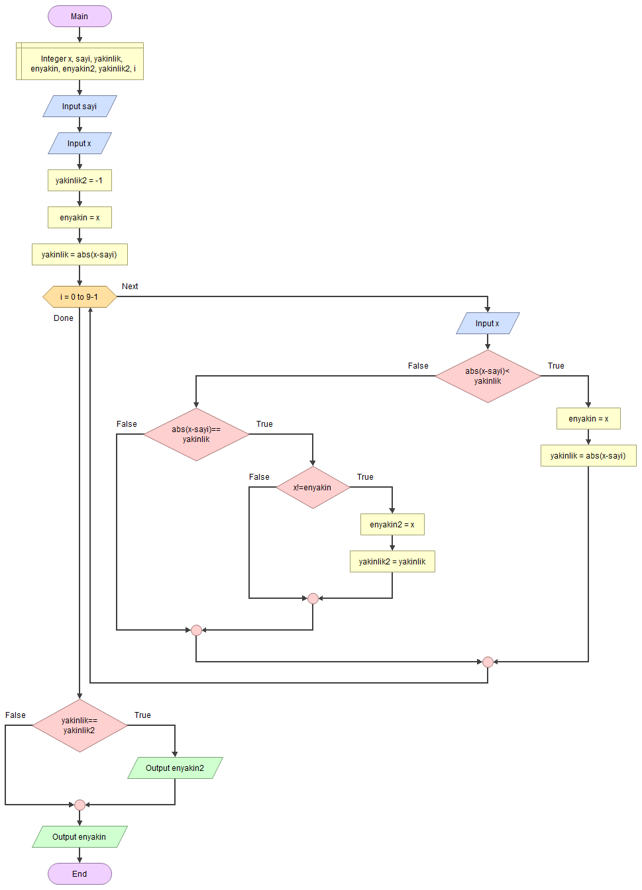

# 🧲 En Yakın Sayıyı Bulmak

<!-- ----------------------------- Soru ----------------------------------- -->

## ❓ Soru
Arka arkaya girilen 10 sayıdan istenilen bir sayıya en yakın olan sayıyı bulan algoritmayı yazınız.

<!-- ----------------------------- Program Kısımları ----------------------------------- -->

## ⛓ Program Kısımları

1. İstenilen sayıyı girmek.
2. 10 tane değer girmek.
3. En yakın değeri bulmak.
4. En yakın değeri ekrana yazdırmak.

<!-- ----------------------------- Çözüm Yöntemi ----------------------------------- -->

## 👓 Çözüm Yöntemi 
- Yakınlık `(a ,b) = |a-b|` olduğu bellidir.
- Her değer girildiğinde yakınlığını hesaplayıp önceki yakınlıkla karşılaştırırız.

<!-- ----------------------------- Çözüm Adımları ----------------------------------- -->

## 👩‍🔧 Çözüm Adımları

1. Değişkenlerin tanımlanması.
2. `sayi`nın girilmesi.
3. İlk `x` değerinin girilmesi.
4. İlk değere göre değişkenlere değer atanması.
5. (10-1) kere dönen döngünün oluşturulması.
   - `x`in girilmesi.
   - Koşullar kontrol edilirken `yakinlik` ve `enyakin` değerlerin değiştirilmesi.
6. Sonuçların yazdırılması.

<!-- ----------------------------- Kodlar ----------------------------------- -->

## 🤖 Kod

[//]: ------------------------------------------------------------------------------
<!-- ----------------------------- C++ Kodu ----------------------------------- -->
[//]: ------------------------------------------------------------------------------

### ⚙ C++ Kodu

```cpp
#include <iostream>

using namespace std;
int main()
{
  int x, sayi, yakinlik, enyakin, i; // Değişkenlerin tanımlanması
  int enyakin2 = 0, yakinlik2 = -1;
  cin >> sayi; // “sayi”nın girilmesi
  cin >> x; // İlk “x” değerinin girilmesi
  enyakin = x; // İlk değere göre değişkenlere değer atanması
  yakinlik = abs(x - sayi);
  for (i = 0; i < 9; i++) {
   cin >> x; // “x”in girilmesi   

   // Koşullar kontrol edilirken “yakinlik” ve “enyakin” değerlerin değiştirilmesi
   if (abs(x - sayi) < yakinlik) { 
    yakinlik =abs(x - sayi);
    enyakin = x;
   } else if (abs(x - sayi) == yakinlik) {
    if (x != enyakin) {
     yakinlik2 = yakinlik;
     enyakin2 = x;
    }
   }
  }
  if (yakinlik2 == yakinlik)
   cout << "Diger en yakin sayi= " << enyakin2; 
  cout << "En yakin sayi= " << enyakin;
 }
```

[//]: ------------------------------------------------------------------------------
<!-- ----------------------------- Python Kodu ----------------------------------- -->
[//]: ------------------------------------------------------------------------------

### 🐍 Python Kodu

```py
enyakin2 = 0; yakinlik2 = -1;
sayi =  int(input()) # “sayi”nın girilmesi
x = int(input()) # İlk “x” değerinin girilmesi
# İlk değere göre değişkenlere değer atanması
enyakin = x
yakinlik = abs(x - sayi) 
for i in range(0,9):  
    x = int(input()) # “x”in girilmesi   
    # Koşullar kontrol edilirken “yakinlik” ve “enyakin” değerlerin değiştirilmesi
    if abs(x - sayi) < yakinlik: 
        yakinlik = abs(x - sayi)
        enyakin = x
    else:
        if abs(x - sayi) == yakinlik:
            if x != enyakin:
                yakinlik2 = yakinlik
                enyakin2 = x
if (yakinlik2 == yakinlik):
    print("Diger en yakin sayi= ", enyakin2)
print("En yakin sayi= ", enyakin)
```

[//]: ------------------------------------------------------------------------------
<!-- ----------------------------- Java Kodu ----------------------------------- -->
[//]: ------------------------------------------------------------------------------

### ☕ Java Kodu

```java
import java.util.*;
public class YakiniBulmak {
 public static void main(String arg[]) {
  Scanner input = new Scanner(System.in);
  // Değişkenlerin tanımlanması
  int x, sayi, yakinlik, enyakin, i, enyakin2 = 0, yakinlik2 = -1;
  sayi = input.nextInt(); // “sayi”nın girilmesi
  x = input.nextInt(); // İlk “x” değerinin girilmesi
  // İlk değere göre değişkenlere değer atanması
  enyakin = x; 
  yakinlik = Math.abs(x - sayi);
  for (i = 0; i < 9; i++) {
   x = input.nextInt(); // “x”in girilmesi   
   // Koşullar kontrol edilirken “yakinlik” ve “enyakin” değerlerin değiştirilmesi
   if (Math.abs(x - sayi) < yakinlik) { 
    yakinlik = Math.abs(x - sayi);
    enyakin = x;
   } else if (Math.abs(x - sayi) == yakinlik) {
    if (x != enyakin) {
     yakinlik2 = yakinlik;
     enyakin2 = x;
    }
   }
  }
  if (yakinlik2 == yakinlik)
   System.out.println("Diger en yakin sayi= " + enyakin2); 
  System.out.println("En yakin sayi= " + enyakin);
  input.close();
 }
}
```

[//]: ------------------------------------------------------------------------------
<!-- ----------------------------- C# Kodu ----------------------------------- -->
[//]: ------------------------------------------------------------------------------

### ⏹ C# Kodu

```cs
using System;
using System.Collections.Generic;
using System.Linq;
using System.Text;
using System.Threading.Tasks;
namespace YakiniBulmak
{
    class Program{
        static void Main(string[] args){
            // Değişkenlerin tanımlanması
            int x, sayi, yakinlik, enyakin, i, enyakin2 = -1, yakinlik2 = -1;
            sayi = Convert.ToInt32(Console.ReadLine());  // “sayi”nın girilmesi
            x = Convert.ToInt32(Console.ReadLine()); // İlk “x” değerinin girilmesi
            // İlk değere göre değişkenlere değer atanması
            enyakin = x;
            yakinlik = Math.Abs(x - sayi);
            for (i = 0; i < 9; i++){
                x = Convert.ToInt32(Console.ReadLine());
                // Koşullar kontrol edilirken “yakinlik” ve “enyakin” değerlerin değiştirilmesi
                if (Math.Abs(x - sayi) < yakinlik){
                    yakinlik = Math.Abs(x - sayi);
                    enyakin = x;
                }
                else if (Math.Abs(x - sayi) == yakinlik){
                    if (x != enyakin){
                        yakinlik2 = yakinlik;
                        enyakin2 = x;
                    }
                }
            }
            if (yakinlik2 == yakinlik)
                Console.WriteLine(enyakin2);
            Console.WriteLine(enyakin);
            Console.ReadLine();
        }
    }
}
```

<!-- ----------------------------- Akış Şeması ----------------------------------- -->

## 🧩 Akış Şeması



<!-- ----------------------------- Ekran Çıktısı ----------------------------------- -->

## 🎉 Ekran Çıktısı

```
5
1   9   0   88  3   4   2   2   11  10
En yakin sayi= 4
```

<!-- ----------------------------- Notlar ----------------------------------- -->

## 💡 Notlar 
1. Bir yakınlık önceki yakınlığa eşitse 2 durum olabilir:
   - `Yakınlık(2) = yakınlık(1)` ise:
     - Ya : `sayı(2) = sayı(1)` ➡ `sayı` tekrarlı.
     - Ya da: sayı `(2) = 2*x – sayı(1)` ➡ sayıların ikisi aynı yakınlıkta, `sayı(2)` değerini `enyakın2` değişkenine atarız.
2. Döngüden çıktıktan sonra `yakinlik = yakinlik2` ise aynı yakınlıkta iki sayı bulunmuş olur, dolayısıyla ikisini yazdırmalıyız.