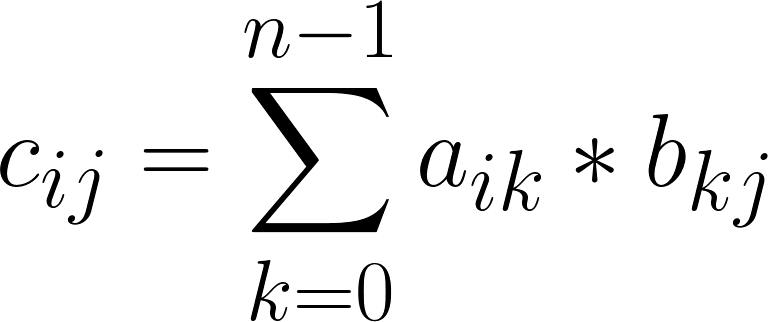

# İki Matrisin Çarpımı

## ❓ Soru
Boyutları ve elemanları klavyeden girilen iki matrisin çarpımını hesaplayan programı yazınız.

## ⛓ Program Kısımları
1. İki matrisin boyutları ve elemanlarını girmek.
2. Çarpma işlemini gerçekleştirmek.
3. Sonuç matrisini yazdırmak.
   
## 👓 Çözüm Yöntemi 
- Çarpma işleminin gerçekleşebilmesi için birinci matrisin sütun sayısı ile ikinci matrisin satır sayısı (n) eşit olmalıdır.
- Sonuç matrisinin her bir elemanı aşağıdaki eşitliği kullanarak elde edilir:




## 👩‍🔧 Çözüm Adımları
1. Değişkenlerin tanımlanması.
2. İki matrisin boyutlarının girilmesi.
3. `A`, `B`, `C` matrislerinin oluşturulması.
4. Çarpım koşulunun kontrol edilmesi.
5. Koşulun sağlandığı halde:
   - `A` elemanları girilir.
   - `B` elemanları girilir.
   - 3 tane iç içe döngü kullanarak `C` elemanları hesaplanır.
   - `C` matrisi yazdırılır.

## 🤖 Kod
<details>
<summary>Tıkla</summary>

```java
import java.util.*;
public class MatrisCarpma {
 public static void main(String arg[]) {
  Scanner input = new Scanner(System.in);
  int m, n, f, p, i, j, k; //1. adim
  System.out.println("A(m,n) Boyutlarini giriniz:");
  m = input.nextInt(); //2. adim
  n = input.nextInt(); //2. adim
  System.out.println("B(f,p) Boyutlarini giriniz:");
  f = input.nextInt(); //2. adim
  p = input.nextInt(); //2. adim
  int A[][] = new int[m][n];
  int B[][] = new int[f][p];
  int C[][] = new int[m][p];
  if (n != f) //4. adim
   System.out.println("Matrisler carpilamaz");
  else { //5. adim
   for (i = 0; i < m; i++)
    for (j = 0; j < n; j++) {
     System.out.printf("A[%d][%d]=", i + 1, j + 1);
     A[i][j] = input.nextInt();
    } //5. adim (a)
   System.out.printf("\n");
   for (i = 0; i < f; i++)
    for (j = 0; j < p; j++) {
     System.out.printf("B[%d][%d]=", i + 1, j + 1);
     B[i][j] = input.nextInt();
    } //5. adim (b)
   for (i = 0; i < m; i++) //5. adim (c)
    for (j = 0; j < p; j++)
     for (k = 0; k < n; k++)
      C[i][j] += A[i][k] * B[k][j];
   System.out.printf("\nA*B=\n");
   for (i = 0; i < m; i++) {
    for (j = 0; j < p; j++)
     System.out.printf("%d\t", C[i][j]); //5. adim (d)
    System.out.printf("\n");
   }
  }
  input.close();
 }
}
```
</details>


## 🎉 Ekran Çıktısı

```
A(m,n) Boyutlarini giriniz:
2
2
B(f,p) Boyutlarini giriniz:
2
3
A[1][1]=1
A[1][2]=2
A[2][1]=3
A[2][2]=4
B[1][1]=1
B[1][2]=2
B[1][3]=3
B[2][1]=4
B[2][2]=5
B[2][3]=6
A*B=
9 12 15
19 26 33
```

## 💡 Notlar 
1. `C`nin satır sayısı `A`nın satır sayısına eşittir ve sütun sayısı `B`nin sütun sayısına eşittir.
Örneğin: A<sub>mn</sub> * B<sub>fp</sub> = C<sub>mp</sub>