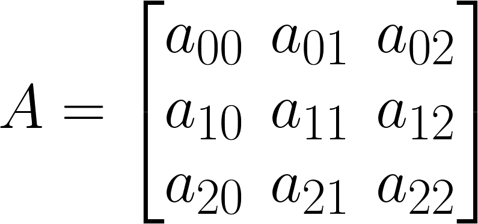

# 🔥 Kare Matrislerin Üzerinde İşlemler

## ❓ Soru
Aşağıdaki fonksiyonları yazıp main içerisinde seçenek listesi olarak çağırınız.
1. Bir kare matrisi okutan fonksiyon.
2. Bir kare matrisi yazdıran fonksiyon.
3. Bir kare matrisin 2 satırını yer değiştiren fonksiyon.
4. Bir kare matrisin köşegenlerini yer değiştiren fonksiyon.
5. Bir kare matrisin elemanlarının aritmetik ortalamasını hesaplayan fonksiyon.

> Not: Program 6 girilene kadar sürekli çalışacaktır.

## ⛓ Program Kısımları
1. main’de kullanılacak değişkenleri ve matrisi tanımlamak.
2. Fonksiyonları main içerisinde switch kullanarak çağırmak.
3. Fonksiyonları yazmak.

## 👓 Çözüm Yöntemi 



- Herhangi bir satırın eleman indeksinde `i` sabitken `j` değişir.
- Asal köşegenin her a<sub>ij</sub> elemanı, `(i=j)` özelliğine sahiptir.
  - Kod örneği: `for(i=0; i<n; i++) { A[i][i] …}`
- Ters köşegenin her aij elemanı, `(j=n-1-i)` özelliğine sahiptir.
  - Kod örneği: `for(i=0; i<n; i++) { A[i][n-1-i] …}`

  
## 👩‍🔧 Çözüm Adımları
1. Değişkenler ve matrisin tanımlanması.
2. `secenek` 6’ya eşit olmadığı sürece:
   - Seçenek listesi yazdırılır.
   - `secenek` değeri girilir.
   - `secenek`e göre switch kullanarak fonksiyon çağırılacak.
     - `secenek = 1`: Matris okutma fonk. çağrılır.
     - `secenek = 2`: Matris yazdırma fonk. çağrılır.
     - `secenek = 3`: Satır yer değiştirme fonk. çağrılır.
     - `secenek = 4`: Köşegen yer değiştirme fonk. çağrılır.
     - `secenek = 5`: Ortalama hesaplama fonk. çağrılır.
     - `secenek = 6`: switch’ten çıkılır.
     - `secenek = Diğer`: Hata mesajı verilir.

<details>
<summary>1. Matris okutma fonksiyonu</summary>

1. Değişkenlerin tanımlanması.
2. Boyutun girilmesi.
3. İç içe döngüyle elemanların girilmesi.
4. Boyutun geri döndürülmesi.
</details>

<details>
<summary>2. Matris yazdırma fonksiyonu</summary>

1. Sayaçların tanımlanması.
2. İç içe döngüyle elemanların yazdırılması.
</details>

<details>
<summary>3. İki satır yer değiştirme fonksiyonu</summary>

1. Değişkenlerin tanımlanması.
2. İstenen satırların girilmesi.
3. Bir döngüyle istenen satırların elemanlarının geçici değişken kullanarak değiştirilmesi.

</details>

<details>
<summary>4. Köşegen yer değiştirme fonksiyonu</summary>

1. Değişkenlerin tanımlanması.
2. Bir döngüyle köşegenlerin elemanlarının geçici değişken kullanarak değiştirilmesi.

</details>

<details>
<summary>5. Ortalama hesaplama fonksiyonu</summary>

1. Değişkenlerin tanımlanması.
2. İç içe döngüyle elemanların toplanması.
3. Toplamın “n2”ye bölünmesi.
4. Ortalamanın geri döndürülmesi.

</details>

## 🤖 Kod
<details>
<summary>Tıkla</summary>


```java
import java.util.*;
public class KareMatris {
 static final int max = 10;
 static Scanner input = new Scanner(System.in);
 public static void main(String arg[]) {
  int n1 = 0, secenek; // 1. adım
  int P[][] = new int[max][max];
  do {
   System.out.printf("========================= ===== \n1- Yeni Matris girmek\n2- Matrisi yazdirmak\n3- 2 satiri degistirmek\n4- Kosegenleri degistirmek\n5- Elemanlar ortalamasini hesaplamak\n6- Exit\nYukaridakilerden bir tane seciniz:"); // 2. Adım (a)
   secenek = input.nextInt(); // 2. Adım (b)
   switch (secenek) { // 2. Adım (c)
    case 1:
     {
      n1 = gir_mat(P);
     }
    case 2:
     {
      print_mat(P, n1);
      break;
     }
    case 3:
     {
      satir_degistir(P, n1);
      break;
     }
    case 4:
     {
      kosegen_degistir(P, n1);
      break;
     }
    case 5:
     {
      System.out.printf("Ortalama= %f\n", ortalama(P, n1));
      break;
     }
    case 6:
     break;
    default:
     System.out.printf("Hata!, Girilecek sayi 1,6 arasinda olmalidir!\n");
   }
  } while (secenek != 6);
 }
 static int gir_mat(int a[][]) { // 1. Adım
  int i, j, n; // 1. Adım (a)
  System.out.printf("Matrisin boyutunu giriniz: ");
  n = input.nextInt(); // 1. Adım (b)
  for (i = 0; i < n; i++) // 1. Adım (c)
   for (j = 0; j < n; j++) {
    System.out.printf("P[%d][%d]=", i + 1, j + 1);
    a[i][j] = input.nextInt();
   }
  return n;
 } // 1. Adım (d)
 static void print_mat(int a[][], int n) { // 2. Adım
  int i, j; // 2. Adım (a)
  System.out.printf("P Matrisi:\n");
  for (i = 0; i < n; i++) {
   for (j = 0; j < n; j++)
    System.out.printf("%d\t", a[i][j]); // 2. Adım (b)
   System.out.printf("\n");
  }
 }
 static void satir_degistir(int a[][], int n) { // 3. Adım
  int i, satir1, satir2, temp; // 3. Adım (a)
  System.out.printf("Degistirmek istediginiz satirlari girininz:\n");
  satir1 = input.nextInt(); // 3. Adım (b)
  satir2 = input.nextInt();
  for (i = 0; i < n; i++) {
   temp = a[satir1 - 1][i]; // 3. Adım (c)
   a[satir1 - 1][i] = a[satir2 - 1][i];
   a[satir2 - 1][i] = temp;
  }
  System.out.printf("%d. satir & %d. satir degistirildi.\n", satir1, satir2);
 }
 static void kosegen_degistir(int a[][], int n) { // 4. Adım
  int i, temp; // 4. Adım (a)
  for (i = 0; i < n; i++) {
   temp = a[i][i]; // 4. Adım (b)
   a[i][i] = a[i][n - 1 - i];
   a[i][n - 1 - i] = temp;
  }
  System.out.printf("Kosegenler degistirildi.\n");
 }
 static float ortalama(int a[][], int n) { // 5. Adım
  int toplam = 0, i, j; // 5. Adım (a)
  float ort;
  for (i = 0; i < n; i++) // 5. Adım (b)
   for (j = 0; j < n; j++)
    toplam += a[i][j];
  ort = (float) toplam / (n * n); // 5. Adım (c)
  return ort; // 5. Adım (d)
 }
}
```
</details>


## 💡 Notlar 
1. Programın switch case’lerini sırayla yapmaması için her case’in sonunda switch kırılır.